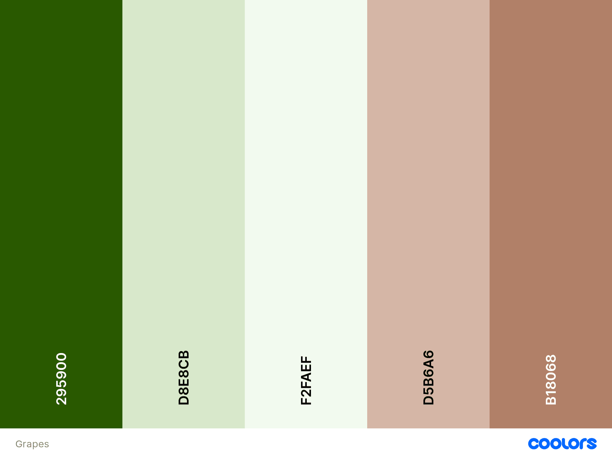

# Isbaner vineyard

_HTML and CSS Essentials Project Portfolio - Code Institute_

View deployed site [here.](https://queenisabaer.github.io/isbaner-vineyard/)

Isbaner vineyard is a site dedicated to the vineyard of the isbaner family. The site is targeted towards interested parties, friends and family who want to know more about the vineyard, stay in touch with the owners or visit them and keep updated through the year. Furthermore it will be useful for people who want to know something about the Gutedel grape and the region Wethau, Saale-Unstrut.  

## Table of contents

* [User Experience (UX)](#user-experience) 
* [Features](#features)
* [Design](#design)
* [Technologies Used](#technologies-used)
* [Testing](#testing)
* [Deployment](#deployment)
* [Credits](#credits)

## User Experience (UX)

### User stories

Goals for:
-   First Time visitor: 
An overview of the vineyard should be given to first-time visitors. Especially when the owners meet new people and tell them about their hobby, they are of course very curious and want to learn more about the vineyard, the grapes that are planted and the winegrowers association of which the owners are member of. Furthermore it's common for them to ask for pictures of the vineyard and garden. It is therefore important to get to the most important content quickly. On the homepage, the three image boxes symbolize the components of the homepage. Clicking on the buttons takes you to the corresponding content. 
-   Returning visitor: 
Returning visitors may want to visit the vineyard or get in touch with the Isbaner family. So the contact area allows them to contact the owners and, for instance, book a wine tasting or a guided tour.
-   Frequent user: 
Frequent users are interested in staying in touch with the owners or want to know what it looks like on the vineyard and what’s new, especially the gallery is interesting for them.

## Design

-   Imagery:
All photos were taken by the owners within the last years and were provided for the project. They reflect the daily reality on the vineyard with all of its beauty.
-   Colour Scheme:
The color scheme should match the vineyard theme and the fact that sandstone is mined in the region, which is also used in the garden. Therefore, with the pipette function on [coloors.co](https://coolors.co/), green and brown shades were chosen, which were taken from the photograph of the background image at contact.html. Since green also dominates in the vineyard, the shade #295900 has become the primary color. The brown shades set accents primarily as a background for buttons and text fields. 

-   Typography: 
Since growing wine is a very old and respected tradition, a handwritten-looking font was chosen as the font for the logo and headings: [Tangerine](https://fonts.google.com/specimen/Tangerine?query=tangerine)
> Tangerine is a calligraphic typeface inspired by many italic chancery hands from the 16th and 17th centuries. *Google Fonts*
The font [Nobile](https://fonts.google.com/specimen/Nobile?query=nobile) was selcted for text content. It was important that this font creates a contrast to logo and heading. It should therefore be clear, simple and easy to read on all screen sizes. 

### Wireframes

- index.html

     

## Features

### Existing Features

- __Navigation Bar__

    - 

      
    

- __Xxx__

    - 

- __Footer__

    - Address & Social Media

      

- __About us Page__

    - The About us page includes various information about the history of the vineyard, the grape Gutedel and the region Wethau

       

- __Gallery Page__

    - The Gallery page will provide users with photographs to see what happens on the vineyard spread over a year.
    - To create the responsive gallery I used the tutorial and css code from [Rüdiger Alte](https://www.imarketinx.de/artikel/responsive-image-gallery-with-css-grid.html)
       

- __Contact Page__

   - The contact page xxx
   - contact form
   - map direction 

      

### Features which I would like to implement in the future

- Gallery with categories for spring, summer, autumn & winter
- bilingual

## Technologies Used

-   [HTML5](https://en.wikipedia.org/wiki/HTML5)
-   [CSS3](https://en.wikipedia.org/wiki/Cascading_Style_Sheets)

-   To import fonts into the style.css: [Google Fonts:](https://fonts.google.com/)
-   To add icons: [Font Awesome:](https://fontawesome.com/)
-   [Git:](https://git-scm.com/) 
-   [GitHub:](https://github.com/)
-   The wireframes were created with [Balsamiq:](https://balsamiq.com/)
-   Color scheme was created with [Coloors](https://coolors.co/image-picker)
-   The pictures were cropped and resized with [iLoveIMG](https://www.iloveimg.com/) 
-   
    

## Testing

1. Validator Testing

- [HTML Validator](https://validator.w3.org/)

    - result for index.html
      
    - result for about.html
      
    - result for gallery.html
          
    - result for contact.html
      
        

2. [CSS Validator](https://jigsaw.w3.org/css-validator/)

    - result for styles.css 
      

      The warning is due to import of the Google fonts.

3. Browser Compatibility

- xxx
  
4. Bugs

- xxx

## Deployment

- xxx

## Credits 

### Content 

- xxx

### Code

- The css code for the responsive picture gallery grid was taken from the tutorial bei [Rüdiger Alte](https://www.imarketinx.de/artikel/responsive-image-gallery-with-css-grid.html)

### Media 

- xxx

### ReadMe

- A big thank you to  and all of her tips on what makes a good README. 

### Acknowledgments

- 

__This is for educational use.__
