# Isbaner vineyard

_HTML and CSS Essentials Project Portfolio - Code Institute_

View deployed site [here.](https://queenisabaer.github.io/isbaner-vineyard/)

Isbaner vineyard is a site dedicated to the vineyard of the Isbaner family. The site is targeted towards interested parties, friends and family who want to know more about the vineyard, stay in touch with the owners or visit them and keep updated through the year. Furthermore it will be useful for people who want to know something about the Gutedel grape and the region Wethau, Saale-Unstrut.

## Table of contents

- [User Experience (UX)](#user-experience)
- [Design](#design)
- [Features](#features)
- [Technologies Used](#technologies-used)
- [Testing](#testing)
- [Deployment](#deployment)
- [Credits](#credits)

## User Experience (UX)

### User stories

Goals for:

- **First time visitor:**
  An overview of the vineyard should be given to first-time visitors. Especially when the owners meet new people and tell them about their hobby, they are of course very curious and want to learn more about the vineyard, the grapes that are planted and the winegrowers association of which the owners are member of. Furthermore it's common for them to ask for pictures of the vineyard and garden. Quick access to the most important information is therefore essential. On the homepage, the three image boxes symbolize the components of the homepage. Clicking on the buttons takes you to the corresponding content.
- **Returning visitor:**
  Returning visitors may want to visit the vineyard or get in touch with the Isbaner family. So the contact area allows them to contact the owners and, for instance, book a wine tasting or a guided tour.
- **Frequent user:**
  Frequent users are interested in staying in touch with the owners or want to know what it looks like on the vineyard and what’s new, especially the gallery is interesting for them.

## Design

- **Imagery:**
  All photos were taken by the owners within the last years and were provided for the project. They reflect the daily reality on the vineyard with all of its beauty.
- **Colour Scheme:**
  The color scheme should match the vineyard theme and the fact that sandstone is mined in the region, which is also used in the garden. Therefore, with the pipette function on [coloors.co](https://coolors.co/), green and brown shades were chosen, which were taken from the photograph of the background image at contact.html. Since green also dominates in the vineyard, the shade #295900 has become the primary color. The brown shades set accents primarily as a background for buttons and text fields.
  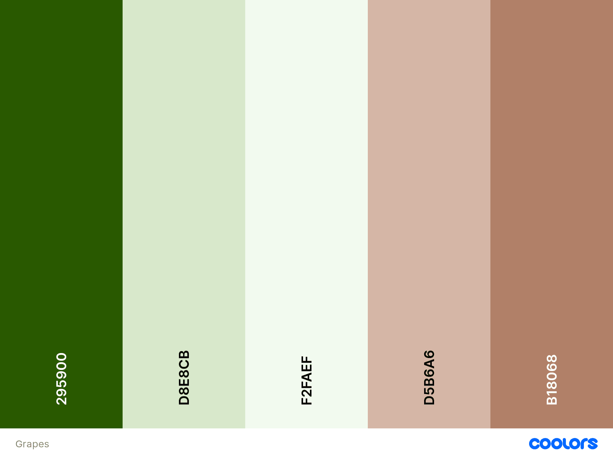
- **Typography:**
  The font [Nobile](https://fonts.google.com/specimen/Nobile?query=nobile) was selected for text content. It was important that this font creates a contrast to logo and heading. It should therefore be clear, simple and easy to read on all screen sizes.
  Since growing wine is a very old and respected tradition, a handwritten-looking font was chosen as the font for the logo and headings: [Tangerine](https://fonts.google.com/specimen/Tangerine?query=tangerine)
  > Tangerine is a calligraphic typeface inspired by many italic chancery hands from the 16th and 17th centuries. _(Google Fonts)_

### Wireframes

 index.html 

 
For simplicity's sake the logo has been left in the navigation bar. In addition, the buttons have been moved to the top left of the images to avoid covering the photos.

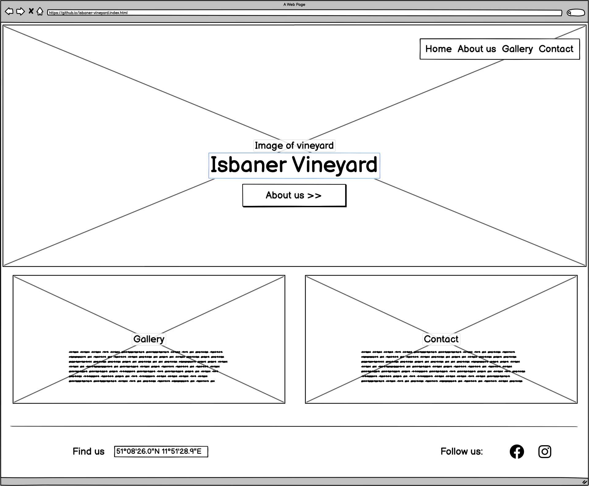

 about-us.html 

 
Since i've learned that buttons and links have different roles, I did not design the links as a button. especially since this design also resulted in a warning in the html validator.

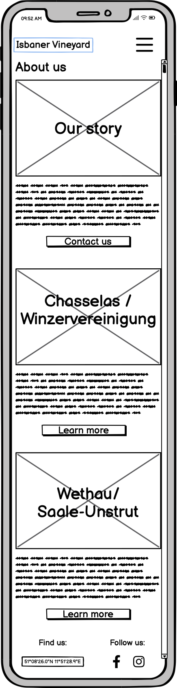

 gallery.html 

 

The gallery was created without caption. This is a feature I would like to integrate in the future.

 contact.html 

 

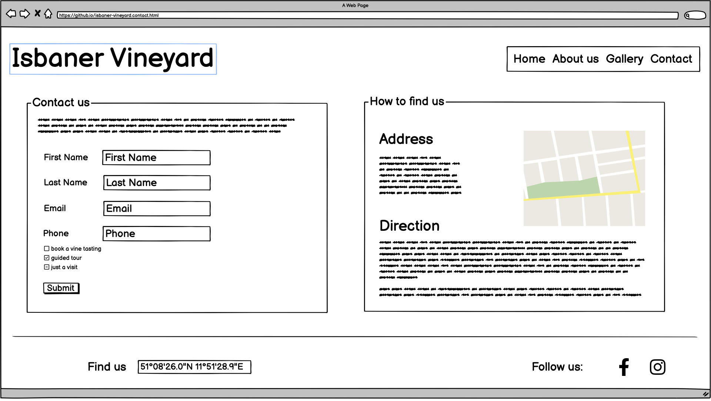
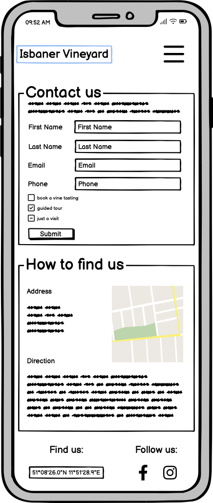

## Features

### Existing Features

All the pages were created with a mobile first approach and are made responsive. To ensure that the layout of the pages remains consistent even on very large screens, the text body has been given a maximum width and a margin on both sides.  
Every page contains a responsive navigation bar on the top with a logo on the left side and the navigation on the right that supports easy navigation. On small screens (e.g. mobile devices) the navigation will become a clickable burger toggler. To make it easier for users to know where they are on the website, the current page is underlined.

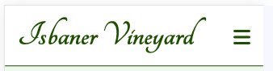
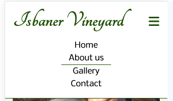
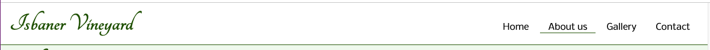

The footer stays on the bottom of every page and features clickable social media icons and the coordinates of the vineyard, which act as a link to google maps. All links on the footer are opened in a new tab.
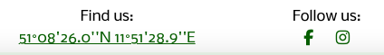

- **Hero image**

The hero image on the main page shows a lovely view over the vineyard. This is intended to convey the beauty of the vineyard directly to the user. In the upper left corner there is a link button that points to the about us page. The button was moved to the side, unlike originally planned, so that the image is not disturbed to.
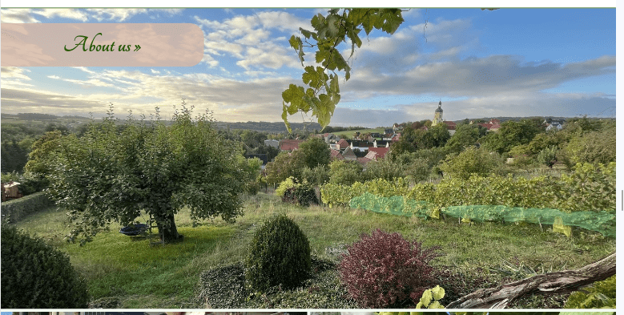 
Below the hero image there are two image containers that refer to the other subpages of the website. They were adapted to the layout of the hero image.
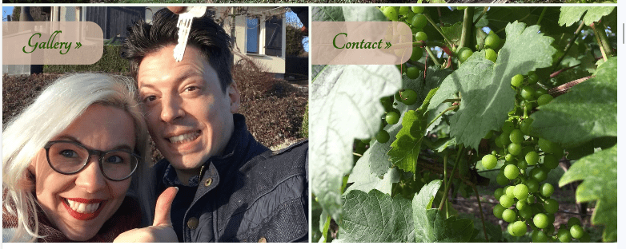

- **About us Page**

The _About us_ page consists of three parts. The first part tells the short story about the owners of the vineyard, the second gives some information about the grape chasselas and the third part highlights the region where the vinyard is located. Each section contains an image, a heading, some text and a link. When viewed on a mobile phone the image will be placed on top of the heading. The links change their apperence when hovered.

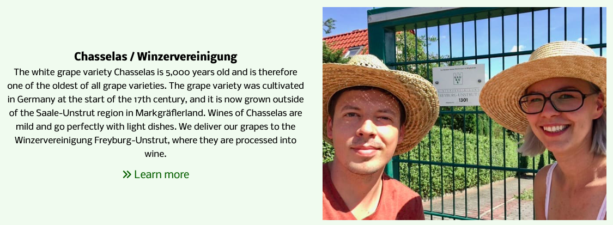

- **Gallery Page**

The Gallery page will provide users with photographs to see what happens on the vineyard spread over a year. It has two main sections. The first contains horizontal photographs and the second vertical ones.
To create the responsive gallery I used the tutorial and css code for a grid gallery by [Rüdiger Alte](https://www.imarketinx.de/artikel/responsive-image-gallery-with-css-grid.html)
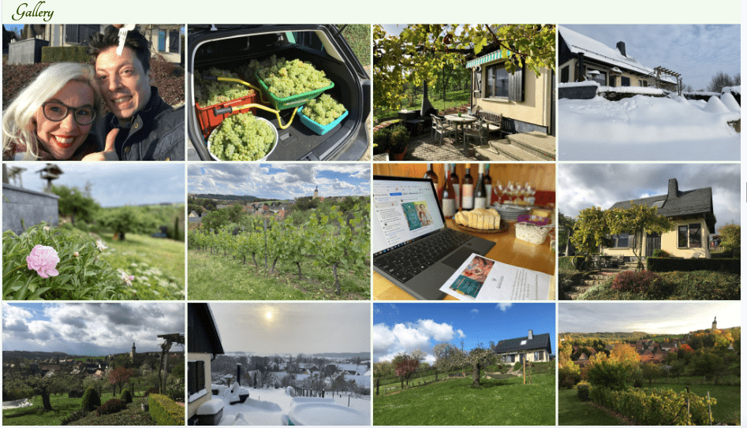

- **Contact Page**

The contact page contains two areas. The first offers a contact form that users can complete to get in touch with the owners of the vineyard. The user is asked to enter their first name, last name and e-mail address when sending a message. This information is mandatory. After submitting the form, a new tab with the results are displayed. Currently it shows the formdump.codeinstitute.net page with the determined form data. Unfortunately, the Code Institute formdumb is not designed to display multiple entries in checkboxes, which is why only the first one is displayed as value. 
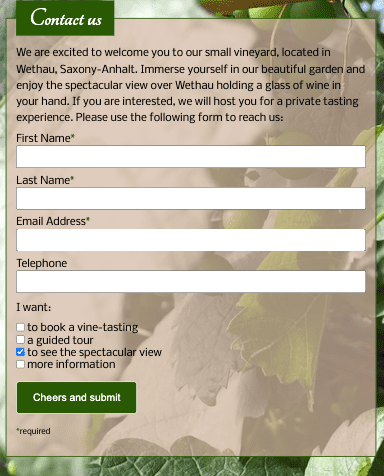 
The second area provides directions to the vineyard. Both images are screenshots from google as in germany it is not permitted to use the interactive google map due to data security concerns. However, clicking on the images takes the user to the Google Maps page in a new tab.
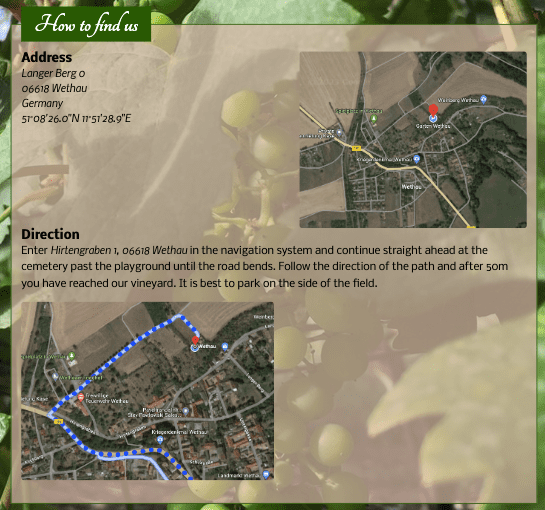

### Features, which I would like to implement in the future

- As the gallery is currently very simple, I would like to improve it in the future. I could imagine a different design with enlargeable images and subtitles. Furthermore I would create tags with categories for spring, summer, autumn & winter.
- I would like to create my personal page after submitting the form and of course use a corresponding data processing programm.
- Since German is my native language, I would love to make a german version of the website.
- Add a favicon.

## Technologies Used

- [HTML5](https://en.wikipedia.org/wiki/HTML5)
- [CSS3](https://en.wikipedia.org/wiki/Cascading_Style_Sheets)
- [Google Fonts](https://fonts.google.com/) was used to import fonts into the style.css.
- [Font Awesome](https://fontawesome.com/) was used to add icons.
- [Git](https://git-scm.com/) was used for version control by utilizing the Gitpod terminal to commit to Git and Push to GitHub.
- [GitHub](https://github.com/) was used to save and store the files for the website.
- [Balsamiq](https://balsamiq.com/) was used to design the wireframes.
- [Coloors](https://coolors.co/image-picker) was used to create the color scheme.
- [iLoveIMG](https://www.iloveimg.com/) was used to cropp and resize the images.
- [Pixelied](https://pixelied.com/) was used to convert images from jpg to webp
- [Am I Responsive](https://ui.dev/amiresponsive) was used to display the website on different devices.
- [beautifier](https://beautifier.io/) to beautify the code

## Testing

1. **Validator Testing**

- **[HTML Validator](https://validator.w3.org/)**

  - result for index.html 
    First I had an error because my semantics of the h2/button element weren't correct. No errors or warnings were found after fixing this problem.
    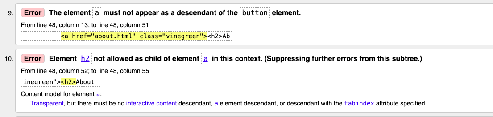
    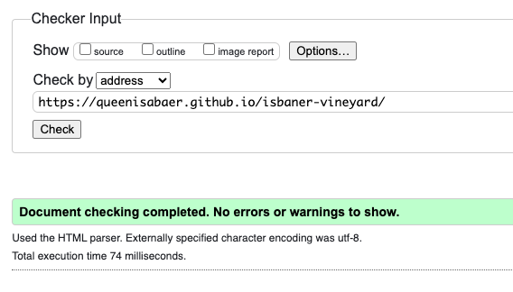 
  - result for about.html 
    I made a mistake because I used a link within a button element, which is semantically wrong. I deleted the button and styled the link instead and no more errors were found.
    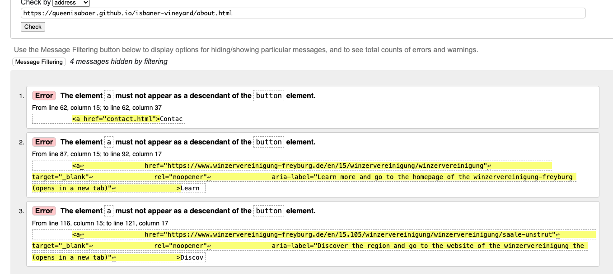
    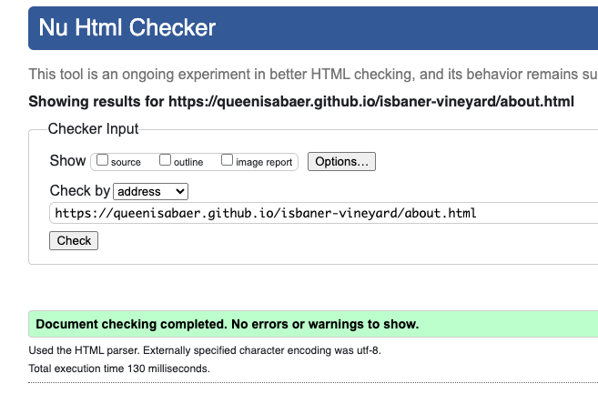 
  - result for gallery.html 
    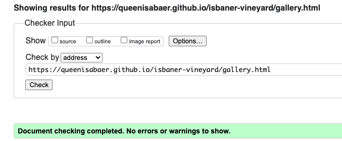 
  - result for contact.html 
    On the contact page I forgot to delete a paragraph tag and incorrectly assigned an ID to two other elements. After I individualized them, no further errors were found.
    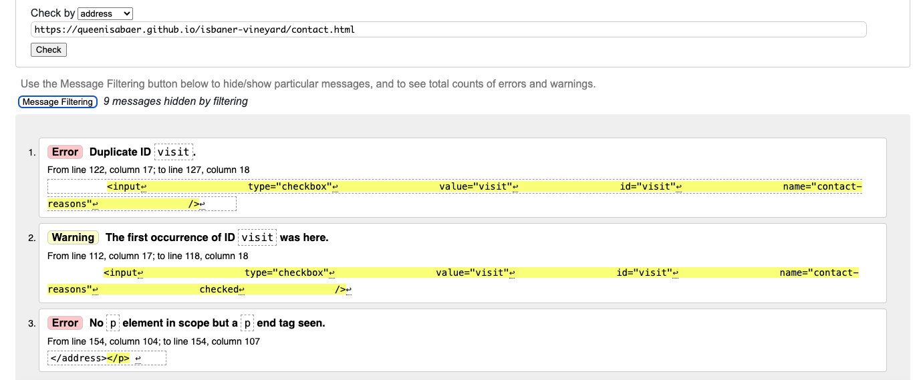
    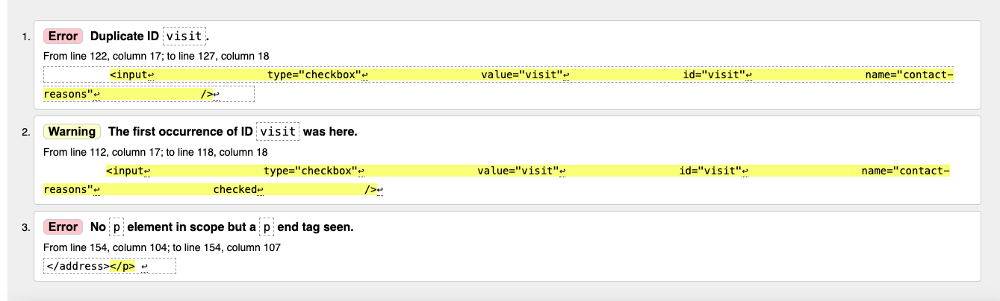
    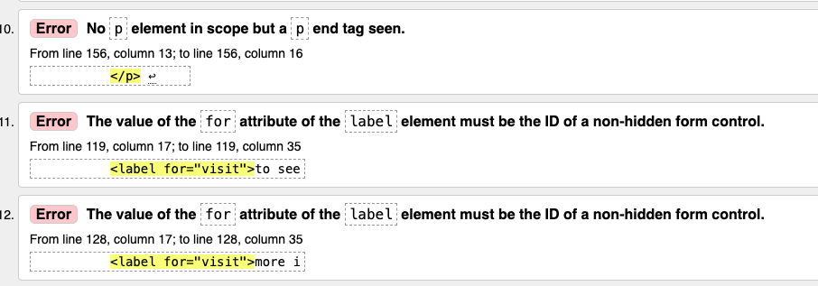
    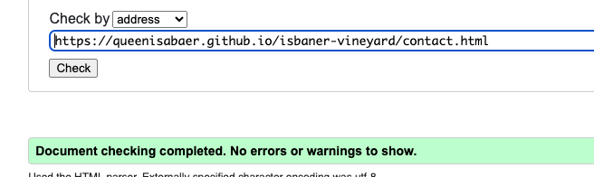 

I also checked all pages in the validator via text-input and likewise no errors were detected in this way. All I got was a information to avoid trailing slashes in void elements.

- **[CSS Validator](https://jigsaw.w3.org/css-validator/)**
   - result for styles.css  
     The only warning I received initially was the use of a text wrap property. I could easily fix this by changing it into the white-space property.
     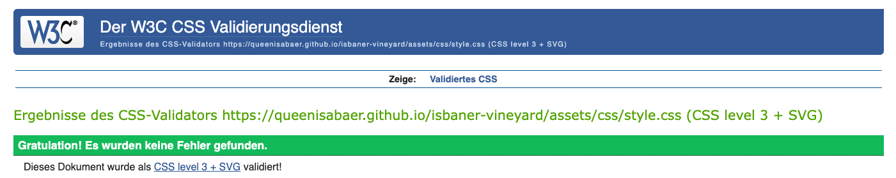
     The warning is due to import of the Google fonts.

2. **Lighthouse Test** 
   To measure the website against performance, accessibility, SEO and best practice I used [Lighthouse](https://chromewebstore.google.com/detail/lighthouse/blipmdconlkpinefehnmjammfjpmpbjk?hl=de). 
   I could improve the accessibility by changing the quotation marks, which are a part of the coordinates and can not be used in the aria-label, into two single quotes.

- result for index.html: 
1. with warning for accessibility
  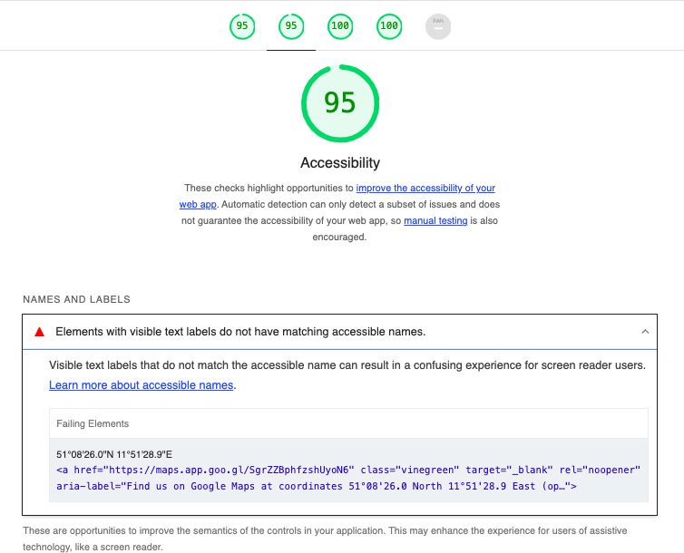 
  2. desktop
  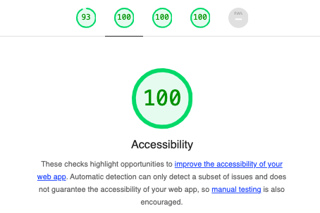 
- result for about.html: 
  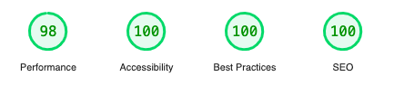 
- result for gallery.html: 
1. mobile
  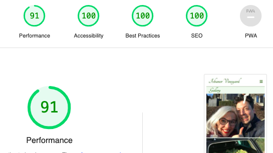 
  2. desktop
  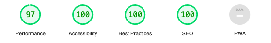 
- result for contact.html: 
  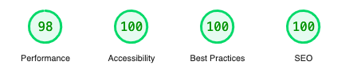

3. **Manual testing**  

To ensure the pages are responsive, I used the Google Chrome developer tools.
| **Test** | **Test Description** | **Expected Outcome** | **Result**|
|:---|:---|:---|:---|
| Header - Logo | Click on the logo to return to main page |On each page, when the logo is clicked you should return to main page | Pass |
| Header - Navbar toggler in mobile view | Click in mobile view on the burger icon to open the navigation | When the burger icon in mobile view is clicked, the navigation should open | Pass |
| Header - Navigation underline | The page you are currently on should be underlined in the menu | After reaching "Home", "About", "Gallery" or "Contact" the corresponding navigation item should be underlined | Pass |
| Header - Navigation link | Click on a term in the navigation bar to go to the corresponding page | Clicking "Home", "About", "Gallery" or "Contact" should take the user to the corresponding page | Pass |
| Footer - Coordinates | Click on the coordinates in the footer and a new tab with google maps opens | After clicking on the coordinates, a new tab with Google Maps should open with the coordinates already located | Pass|
| Footer - Social Media icons | Click on the logo of Facebook or Instagram and a new tab with Facebook page or Instagram page opens | After clicking on the logo of Facebook it should open a new tab with the Facebook page, and after clicking on the Instagram logo, Instagram should open in a new tab as well | Pass |
| Main page - Text hover | Hover over the text in the buttons to change its color | When you hover over the text on the buttons on the main page, they should change color | Pass |
| Main page - Text links| Click on the text in the buttons to reach the corresponding page | When the text on the buttons on the main page is clicked, the corresponding page should open | Pass |
| About-us page - Links hover | Hover over the link-text on the about us page | When you hover over the links on the about page, they should change color | Pass |
| About-us page - Links | Click on the links on the about us page to open the corresponding page | When you click on the links on the about page, the corresponding pages should open. | Pass |
| About-us page - Links Winzervereinigung /region | Click on the links to the Winzervereinigung or the region on the about us page to open the corresponding page in a new tab | When you click on the links to the Winzervereinigung or the region on the about page, the corresponding pages should open in a new tab. | Pass |
| Gallery responsiveness | Change the size of the screen | The images should load nicely and depending on the screen width in one, two, three or four columns | Pass |
| Contact page - form, name input | Try to submit form with no value in input field first name or last name | Form is not submitted and user is asked to enter the first name and last name | Pass |
| Contact page - form, no email input | Try to submit form with no value in input field email | Form is not submitted and user is asked to enter an email address | Pass |
| Contact page - form, wrong email input | Try to submit form without an actual email address in input field email | Form is not submitted and user is asked to enter a valid email address | Pass |
| Contact page - form submission | Click on the "cheers and submit" button. A new page with Code Institute formdumb should open | After all required contact fields have been filled out, click on the cheers and submit button. A new page with Code Institute formdumb should open | Pass |
| Contact page - images with links | Click on the images in the "How to find us" section and a new tab with google maps opens | After clicking on the images in the "How to find us" section", a new tab with Google Maps should open with the coordinates already located | Pass |
| Responsiveness mobile - navigation | Open website on mobile | On mobile screens the navigation should be a first seen as burger icon | Pass |
| Responsiveness 4K+ | Open the website on 4K or larger screen | The website should have a maximum witdh and stay in the middle. The background color should be a light green, according to the color scheme | Pass |

4. **Browser Compatibility** 
   The tests were conducted using the following browsers:

- Google Chrome Version 120.0.6099.71
- Safari on Mac Version 17.0 (17616.1.27.111.22, 17616)
- Safari on iOS 17.1.2
- Edge Version 120.0.2210.61

5. **Bugs**

- No bugs were found.

## Deployment

The site is deployed using GitHub Pages.

## Credits

### Content

- I used for information about chasselas and the winegrowers association: [Weinlaube](https://www.weinlaube.de/weinwissen/rebsorten/weisse/gutedel/) and the website of the [Winzervereinigung Freyburg-Unstrut](https://www.winzervereinigung-freyburg.de/en/15/winzervereinigung/winzervereinigung)

### Code

- The css code for the responsive picture gallery grid was taken from the tutorial bei [Rüdiger Alte](https://www.imarketinx.de/artikel/responsive-image-gallery-with-css-grid.html)
- To understand more about the concepts of html and css fundamentals such as float-property, flexbox and grid, I used the udemy course: [The complete 2023 Web Development Bootcamp by Dr. Angela Yu](https://www.udemy.com/course/the-complete-web-development-bootcamp/)
- The following websites were used as a source of knowledge:  
  - [Google](www.google.com)
  - [mdn](https://developer.mozilla.org/en-US/)
  - [W3C](https://www.w3.org/)
  - [W3schools](https://www.w3schools.com/)
  - [DevDocs](https://devdocs.io/)
  - [Stack Overflow](https://stackoverflow.com/)
  - Slack Community

### Media

- Icons on the footer, the header and for links were taken from [Font Awesome](https://fontawesome.com/)
- The fonts were imported from [Google Fonts](https://fonts.google.com/)

### ReadMe

- A big thank you to [Kera Cudmore](https://github.com/kera-cudmore) and all of her tips on what makes a good README.

### Acknowledgments

- I would like to thank my wonderful mentor Brian Maccheria for his numerous tips and great assistance during the creation of this project.

**This is for educational use.**