# Isbaner vineyard

_HTML and CSS Essentials Project Portfolio - Code Institute_

View deployed site [here.](https://queenisabaer.github.io/isbaner-vineyard/)

Isbaner vineyard is a site dedicated to the vineyard of the Isbaner family. The site is targeted towards interested parties, friends and family who want to know more about the vineyard, stay in touch with the owners or visit them and keep updated through the year. Furthermore it will be useful for people who want to know something about the Gutedel grape and the region Wethau, Saale-Unstrut.  

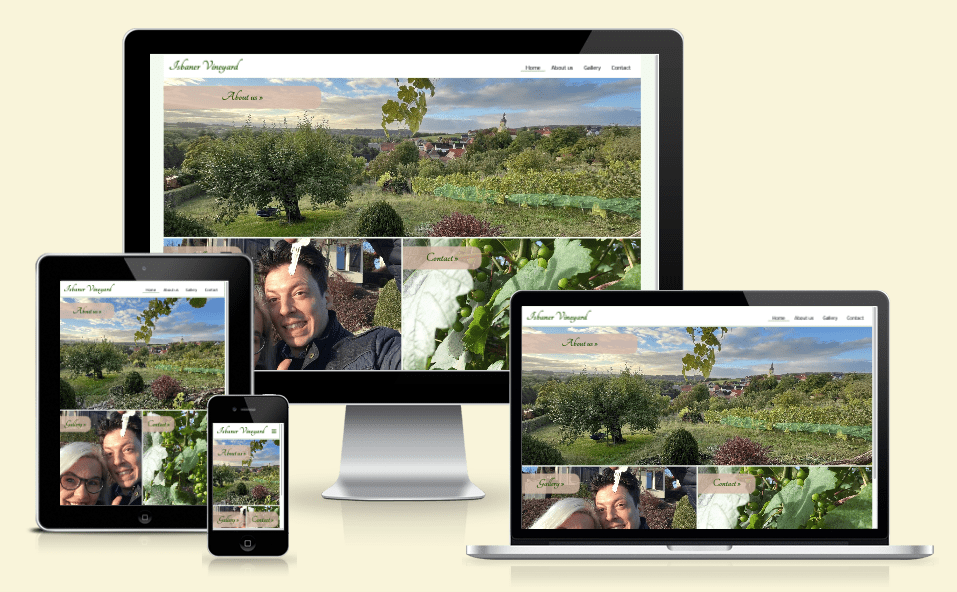

## Table of contents

* [User Experience (UX)](#user-experience) 
* [Design](#design)
* [Features](#features)
* [Technologies Used](#technologies-used)
* [Testing](#testing)
* [Deployment](#deployment)
* [Credits](#credits)

## User Experience (UX)

### User stories

Goals for:
-   **First time visitor:** 
An overview of the vineyard should be given to first-time visitors. Especially when the owners meet new people and tell them about their hobby, they are of course very curious and want to learn more about the vineyard, the grapes that are planted and the winegrowers association of which the owners are member of. Furthermore it's common for them to ask for pictures of the vineyard and garden. Quick access to the most important information is therefore essential. On the homepage, the three image boxes symbolize the components of the homepage. Clicking on the buttons takes you to the corresponding content. 
-   **Returning visitor:** 
Returning visitors may want to visit the vineyard or get in touch with the Isbaner family. So the contact area allows them to contact the owners and, for instance, book a wine tasting or a guided tour.
-   **Frequent user:** 
Frequent users are interested in staying in touch with the owners or want to know what it looks like on the vineyard and what’s new, especially the gallery is interesting for them.

## Design

-   **Imagery:**
All photos were taken by the owners within the last years and were provided for the project. They reflect the daily reality on the vineyard with all of its beauty. 
-   **Colour Scheme:**
The color scheme should match the vineyard theme and the fact that sandstone is mined in the region, which is also used in the garden. Therefore, with the pipette function on [coloors.co](https://coolors.co/), green and brown shades were chosen, which were taken from the photograph of the background image at contact.html. Since green also dominates in the vineyard, the shade #295900 has become the primary color. The brown shades set accents primarily as a background for buttons and text fields. 

-   **Typography:** 
The font [Nobile](https://fonts.google.com/specimen/Nobile?query=nobile) was selected for text content. It was important that this font creates a contrast to logo and heading. It should therefore be clear, simple and easy to read on all screen sizes. 
Since growing wine is a very old and respected tradition, a handwritten-looking font was chosen as the font for the logo and headings: [Tangerine](https://fonts.google.com/specimen/Tangerine?query=tangerine)
>
> Tangerine is a calligraphic typeface inspired by many italic chancery hands from the 16th and 17th centuries. *(Google Fonts)*
> 

### Wireframes

 index.html 

 
For simplicity's sake the logo has been left in the navigation bar. In addition, the buttons have been moved to the top left of the images to avoid covering the photos. 

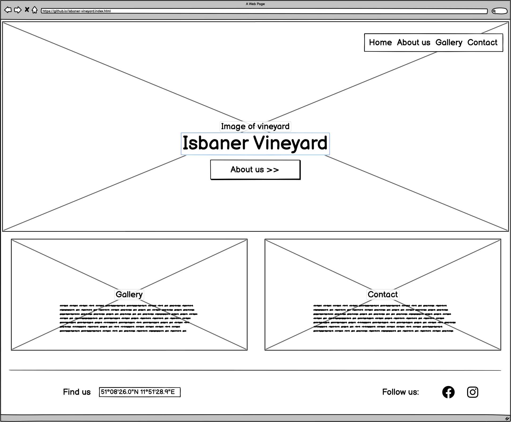
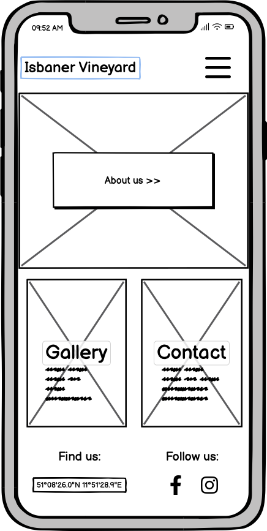

 about-us.html 

 

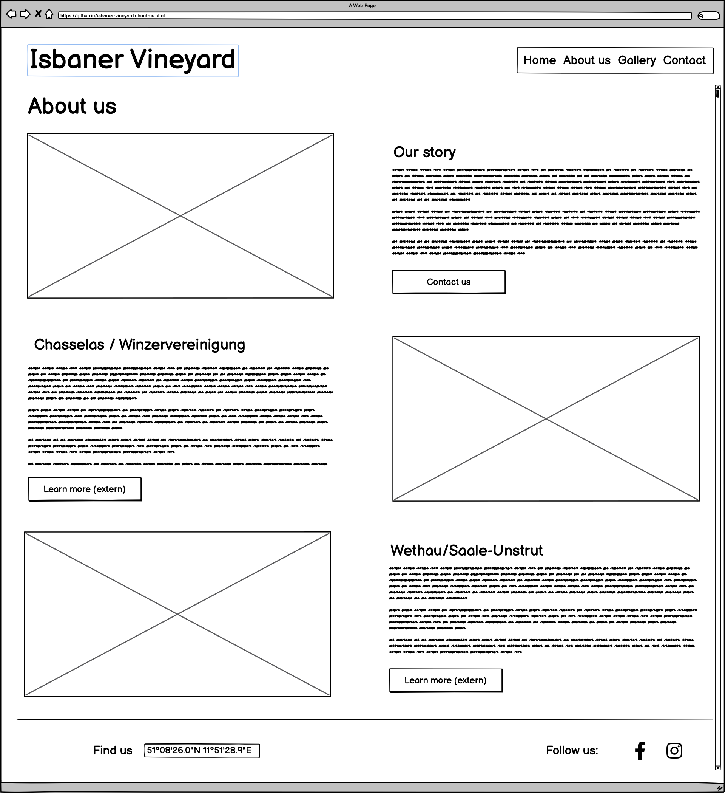
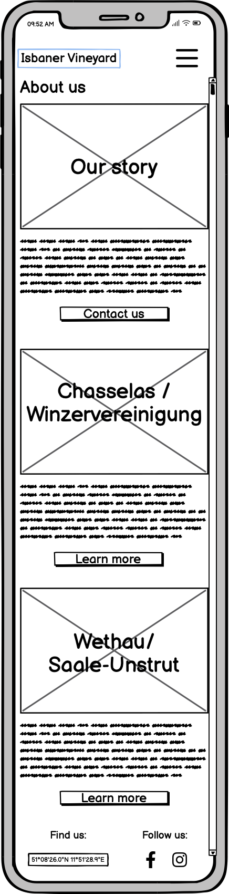

 gallery.html 

 

The gallery was created without caption. This is a feature I would like to integrate in the future. 
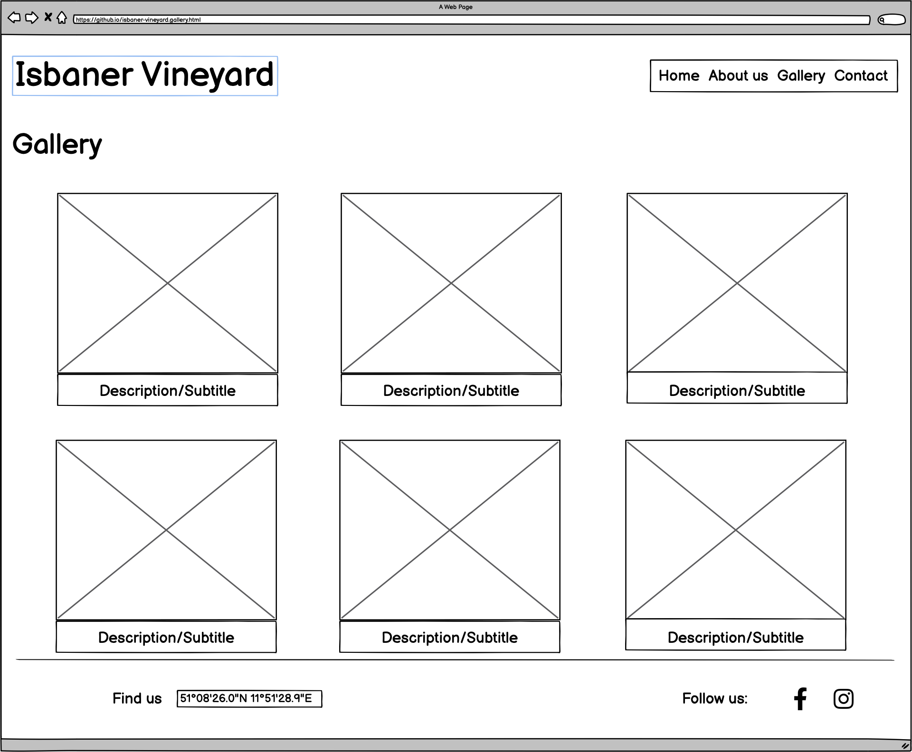
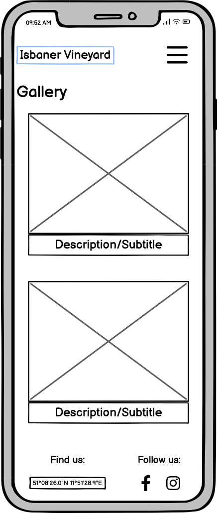

 contact.html 

 

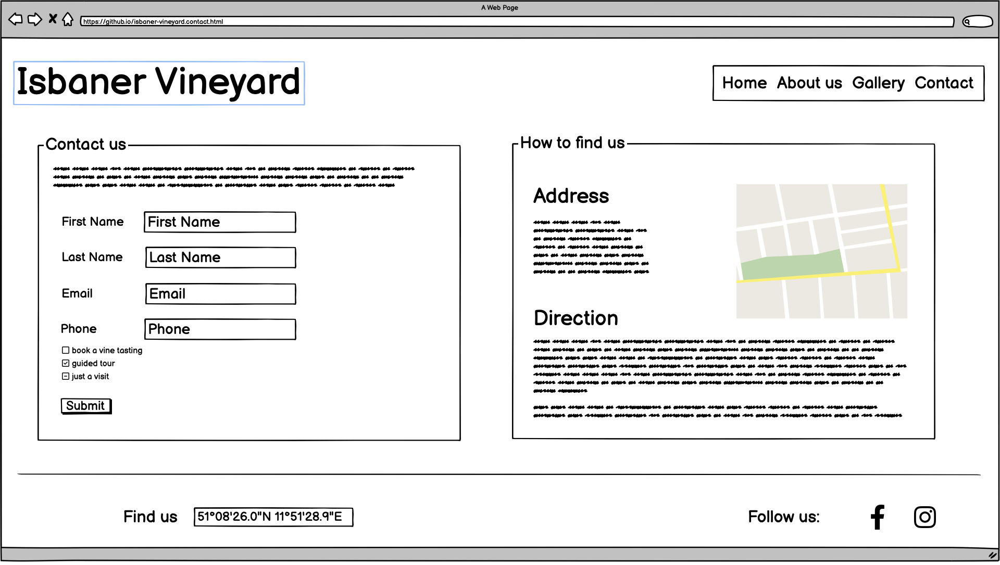
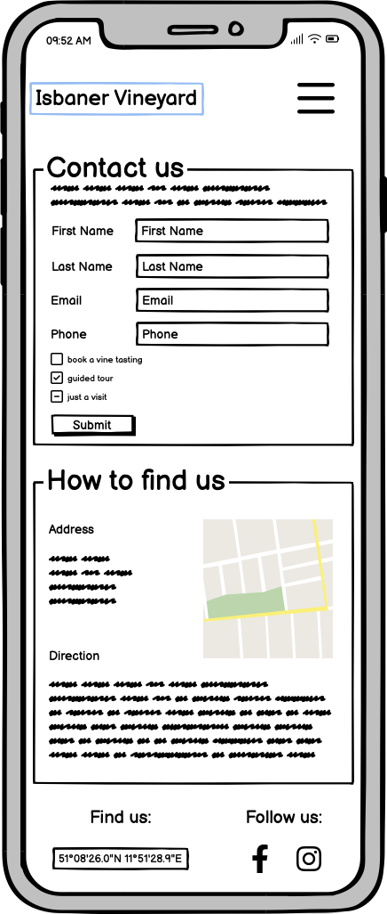

## Features

### Existing Features

All the pages were created with a mobile first approach and are made responsive. To ensure that the layout of the pages remains consistent even on very large screens, the text body has been given a maximum width and a margin on both sides.  
Every page contains a responsive navigation bar on the top with a logo on the left side and the navigation on the right that supports easy navigation. On small screens (e.g. mobile devices) the navigation will become a clickable burger toggler. To make it easier for users to know where they are on the website, the current page is underlined. 

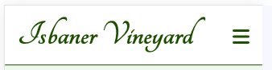
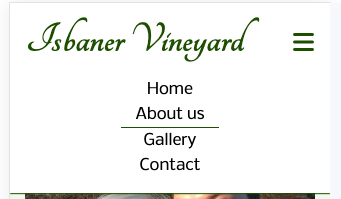
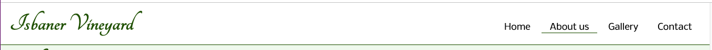

The footer stays on the bottom of every page and features clickable social media icons and the coordinates of the vineyard, which act as a link to google maps. All links on the footer are opened in a new tab.
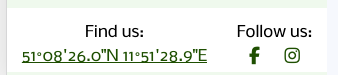
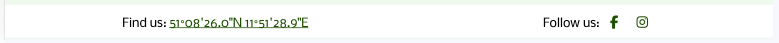

- __Hero image__

The hero image on the main page shows a lovely view over the vineyard. This is intended to convey the beauty of the vineyard directly to the user. In the upper left corner there is a link button that points to the about us page. The button was moved to the side, unlike originally planned, so that the image is not disturbed to.
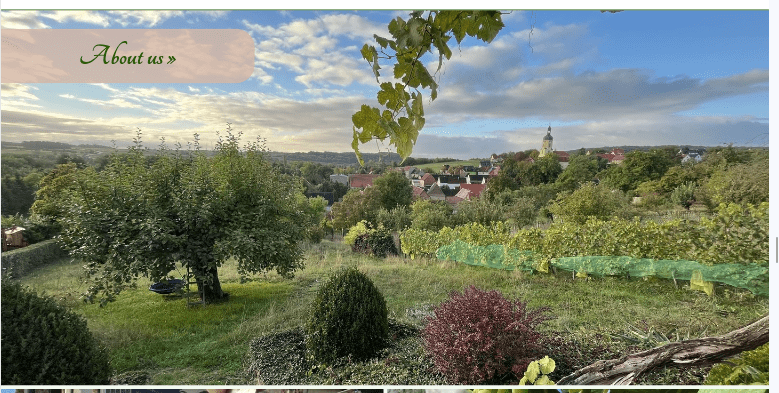 
Below the hero image there are two image containers that refer to the other subpages of the website. They were adapted to the layout of the hero image. 
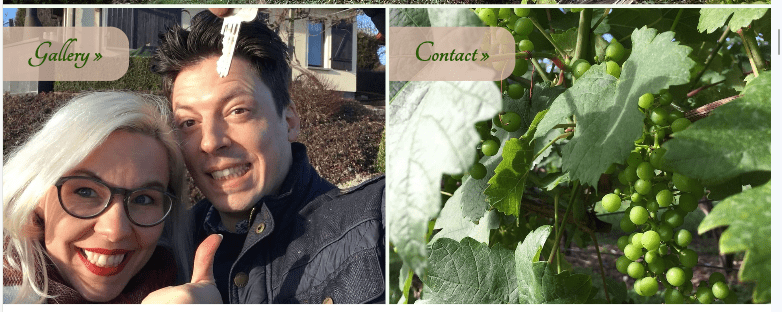

- __About us Page__

The *About us* page consists of three parts. The first part tells the short story about the owners of the vineyard, the second gives some information about the grape chasselas and the third part highlights the region where the vinyard is located. Each section contains an image, a heading, some text and a button. When viewed on a mobile phone the image will be placed on top of the heading. The buttons change their apperence when hovered. 

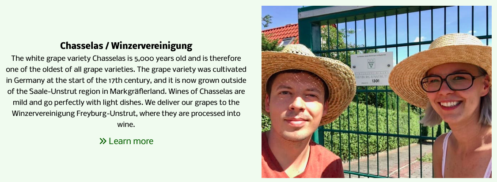

- __Gallery Page__

The Gallery page will provide users with photographs to see what happens on the vineyard spread over a year. It has two main sections. The first contains horizontal photographs and the second vertical ones. 
To create the responsive gallery I used the tutorial and css code for a grid gallery by [Rüdiger Alte](https://www.imarketinx.de/artikel/responsive-image-gallery-with-css-grid.html)
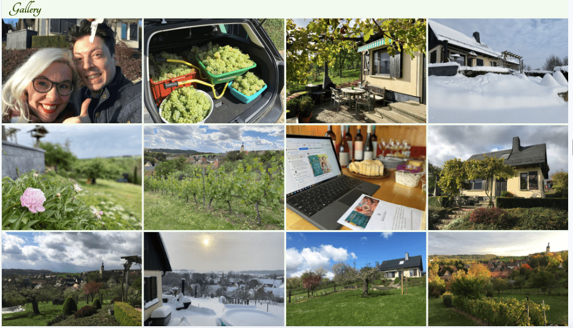

- __Contact Page__

The contact page contains two areas. The first offers a contact form that users can complete to get in touch with the owners of the vineyard. The user is asked to enter their first name, last name and e-mail address when sending a message. This information is mandatory. After submitting the form, a new tab with the results are displayed. Currently it shows the formdump.codeinstitute.net page with the determined form data. 
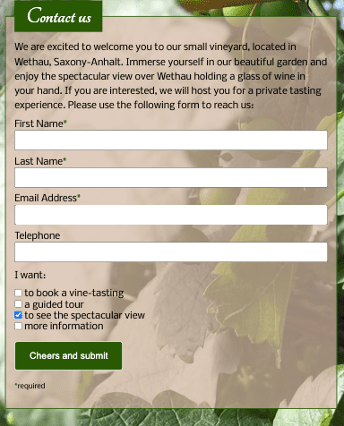 
The second area provides directions to the vineyard. Both images are screenshots from google as in germany it is not permitted to use the interactive google map due to data security concerns. However, clicking on the images takes the user to the Google Maps page in a new tab.
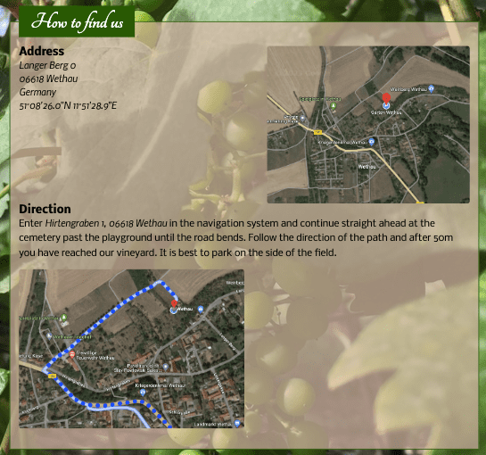

### Features, which I would like to implement in the future

- As the gallery is currently very simple, I would like to improve it in the future. I could imagine a different design with enlargeable images and subtitles. Furthermore I would create tags with categories for spring, summer, autumn & winter. 
- I would like to create my personal page after submitting the form and of course use a corresponding data processing programm. 
- Since German is my native language, I would love to make a german version of the website.
- Add a favicon. 

## Technologies Used

-   [HTML5](https://en.wikipedia.org/wiki/HTML5)
-   [CSS3](https://en.wikipedia.org/wiki/Cascading_Style_Sheets)
-   [Google Fonts](https://fonts.google.com/) was used to import fonts into the style.css.
-   [Font Awesome](https://fontawesome.com/) was used to add icons.
-   [Git](https://git-scm.com/) was used for version control by utilizing the Gitpod terminal to commit to Git and Push to GitHub. 
-   [GitHub](https://github.com/) was used to save and store the files for the website.
-   [Balsamiq](https://balsamiq.com/) was used to design the wireframes.
-   [Coloors](https://coolors.co/image-picker) was used to create the color scheme.
-   [iLoveIMG](https://www.iloveimg.com/) was used to cropp and resize the images.
-   [Am I Responsive](https://ui.dev/amiresponsive) was used to display the website on different devices. 

## Testing

1. Validator Testing

- [HTML Validator](https://validator.w3.org/)

    - result for index.html 
      First I had an error because my semantics of the h2/button element weren't correct. No errors or warnings were found after fixing this problem.
      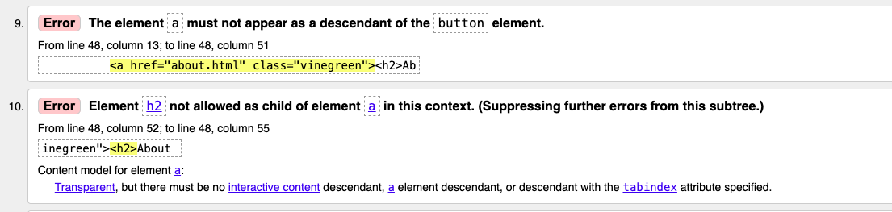
      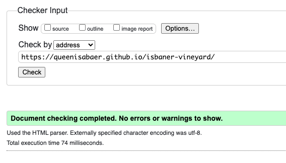
    - result for about.html
      
    - result for gallery.html
          
    - result for contact.html
      
        

2. [CSS Validator](https://jigsaw.w3.org/css-validator/)

    - result for styles.css 
      

      The warning is due to import of the Google fonts.

3. Browser Compatibility

- xxx
  
4. Bugs

- xxx

## Deployment

- xxx

## Credits 

### Content 

- xxx

### Code

- The css code for the responsive picture gallery grid was taken from the tutorial bei [Rüdiger Alte](https://www.imarketinx.de/artikel/responsive-image-gallery-with-css-grid.html)

### Media 

- xxx

### ReadMe

- A big thank you to [Kera Cudmore](https://github.com/kera-cudmore) and all of her tips on what makes a good README. 

### Acknowledgments

- 

__This is for educational use.__
